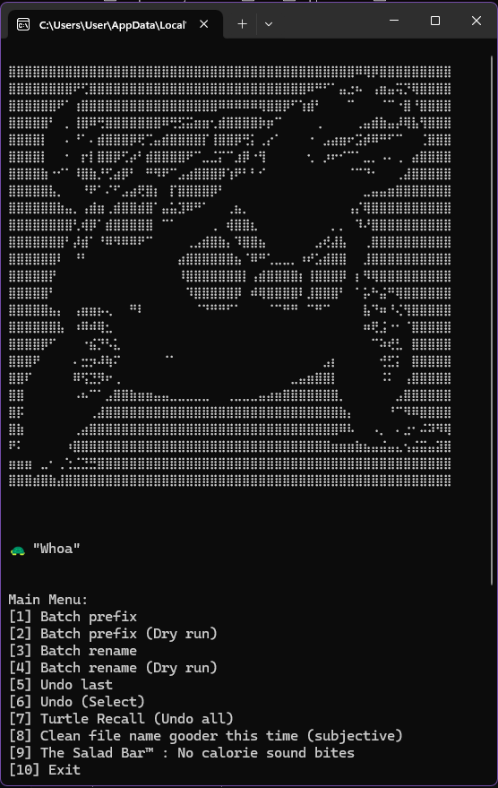
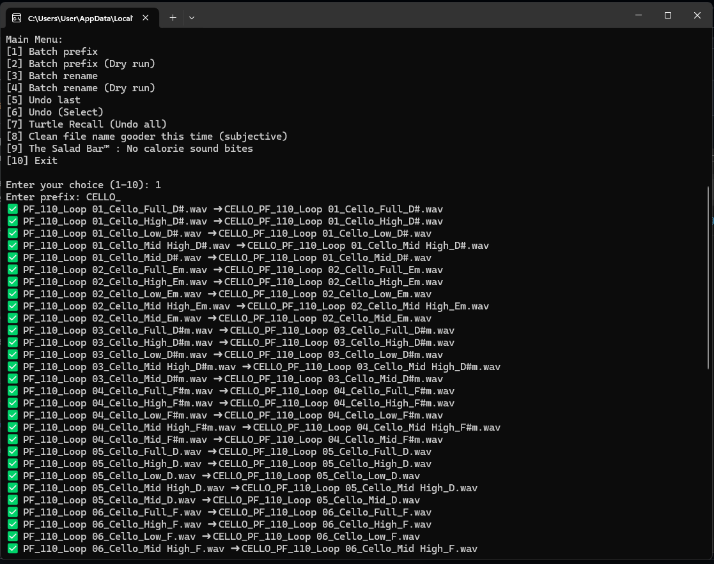
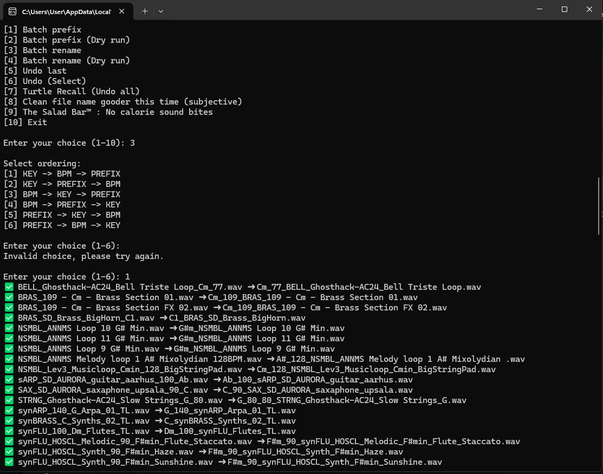
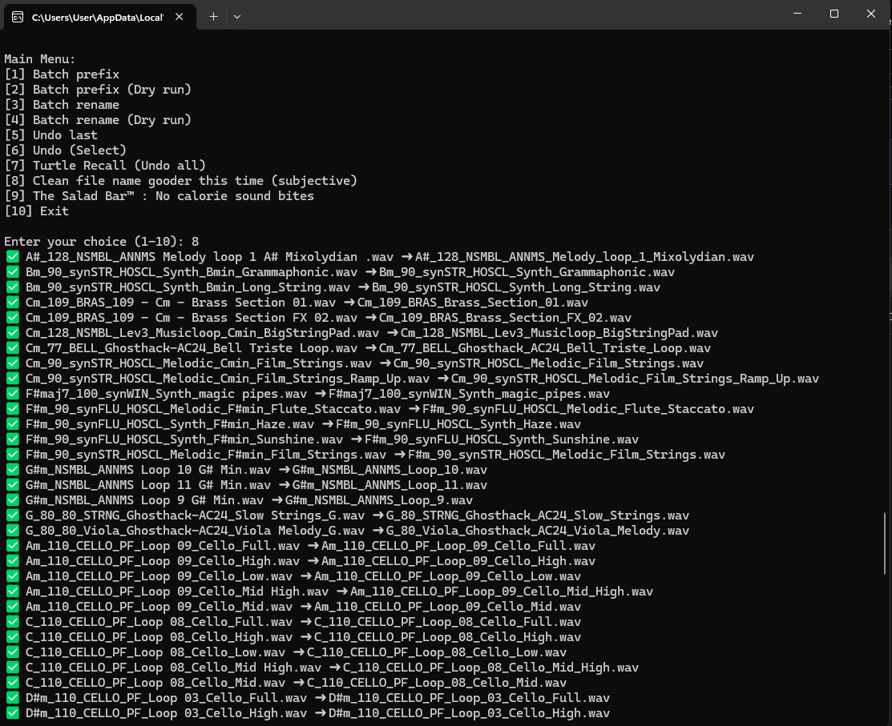
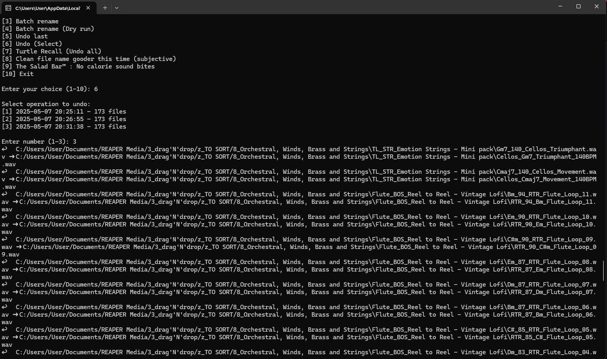
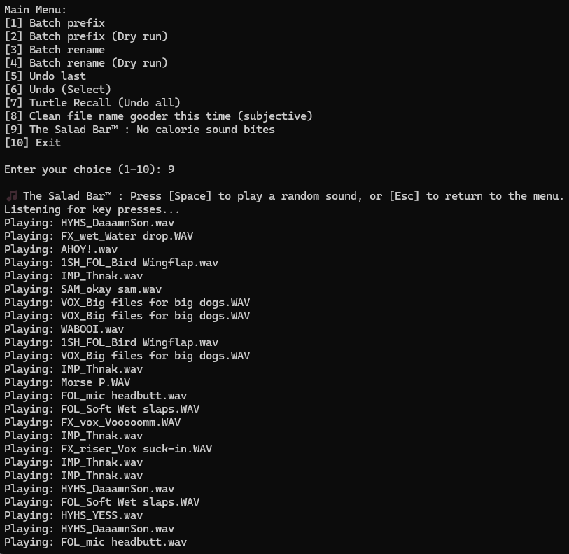

⣿⣿⣿⣿⣿⣿⣿⣿⣿⣿⣿⣿⣿⣿⣿⣿⣿⣿⣿⣿⣿⣿⣿⣿⣿⣿⣿⣿⣿⣿⣿⣿⣿⣿⣿⣿⣿⣿⣿⣿⣿⣿⣿⠿⢿⡿⣿⣿⣿⣿⣿⣿⣿⣿⣿
⣿⣿⣿⣿⣿⣿⣿⣿⠟⢋⣿⣿⣿⣿⣿⣿⣿⣿⣿⣿⣿⣿⣿⣿⣿⣿⣿⣿⣿⣿⣿⣿⣿⣿⣿⣿⣿⠿⠛⠋⠁⣤⣐⠦⠀⢠⣶⣤⢭⡙⢿⣿⣿⣿⣿
⣿⣿⣿⣿⣿⣿⠟⠁⢰⣿⣿⣿⣿⣿⣿⣿⣿⣿⣿⣿⣿⣿⣿⣿⣿⣿⠿⠿⠿⠿⠿⢿⣿⣿⡿⠋⢱⣾⠃⠀⠀⠀⠉⠀⠀⠀⠈⠉⠐⣿⠘⣿⣿⣿⣿
⣿⣿⣿⣿⣿⠃⠀⡀⢸⣿⠿⢛⣿⣿⣿⣿⣿⣿⣿⠿⢛⣫⣭⣶⣶⢂⣾⣿⣿⣿⣿⡷⡶⠉⠀⠀⠀⠀⢀⠀⠀⠀⠀⢀⣤⣾⣷⣤⡼⢿⣧⢻⣿⣿⣿
⣿⣿⣿⣿⡇⠀⠀⠄⠘⠁⠄⣾⣿⣿⣿⡿⢟⢉⣤⣾⣿⣿⣿⣿⡏⢸⣿⣿⡿⢛⡅⢀⡔⠁⠀⠀⠀⠐⠀⣠⣴⣶⠖⣩⡾⠿⠛⠋⠉⠀⠀⢈⣿⣿⣿
⣿⣿⣿⣿⡇⠀⠀⠂⠀⡖⡇⣿⣿⡿⢋⡴⠃⣾⣿⣿⣿⣿⠟⠉⣀⣈⡍⠉⣰⡿⠐⢻⠀⠀⠀⠀⠀⢂⠀⡰⠖⠊⠉⠁⣀⡀⠠⠄⢀⠀⣴⣿⣿⣿⣿
⣿⣿⣿⣿⣷⠐⠊⠁⠸⣿⣷⡘⢋⣴⡿⠃⠀⠛⠻⠟⠉⣠⣴⣿⣿⣿⡿⢱⠟⠃⠃⠊⠀⠀⠀⠀⠀⠀⠀⠀⠀⠀⠈⠉⠙⠂⠀⠀⢀⣼⣿⣿⣿⣿⣿
⣿⣿⣿⣿⣿⣧⡀⠀⠀⠘⠟⠁⠌⠋⣠⣴⢟⣿⡆⠀⡏⣿⣿⣿⣿⡿⠃⠀⠀⠀⠀⠀⠀⠀⠀⠀⠀⠀⠀⠀⠀⠀⠀⠀⣀⣤⣤⣶⣿⣿⣿⣿⣿⣿⣿
⣿⣿⣿⣿⣿⣿⣷⣤⡀⢠⣾⣶⢀⣾⣿⣿⣾⣿⠁⣤⣥⣹⠿⠛⠁⠀⠀⢀⣦⡀⠀⠀⠀⠀⠀⠀⠀⠀⠀⠀⠀⠀⢠⡌⢿⣿⣿⣿⣿⣿⣿⣿⣿⣿⣿
⣿⣿⣿⣿⣿⣿⣿⣿⢃⢾⡿⠁⣾⣿⣿⣿⣿⣿⠀⠉⠁⠀⠀⠀⠀⢀⠀⢾⣿⣿⣆⠀⠀⠀⠀⠀⠀⠀⠀⠀⡀⡀⠀⠹⠜⣿⣿⣿⣿⣿⣿⣿⣿⣿⣿
⣿⣿⣿⣿⣿⣿⣿⠃⡼⣾⠁⠘⠿⠻⠿⠿⠟⠉⠀⠀⠀⠀⢀⣠⣾⣿⣷⡄⠹⣿⣿⣦⠀⠀⠀⠀⠀⠀⣠⢞⣼⣧⠀⠀⢀⣿⣿⣿⣿⣿⣿⣿⣿⣿⣿
⣿⣿⣿⣿⣿⣿⠇⠀⠘⠃⠀⠀⠀⠀⠀⠀⠀⠀⠀⠀⠀⣴⣿⣿⣿⣿⣿⣿⣦⠈⠿⠛⢁⣀⣀⡀⠰⠞⣡⣾⣿⣿⠀⠀⣸⣿⣿⣿⣿⣿⣿⣿⣿⣿⣿
⣿⣿⣿⣿⣿⡟⠀⠀⠀⠀⠀⠀⠀⠀⠀⠀⠀⠀⠀⠀⠀⠸⣿⣿⣿⣿⣿⣿⣿⡇⢠⣾⣿⣿⣿⣿⡆⢸⣿⣿⣿⡿⠀⡆⠻⢿⣿⣿⣿⣿⣿⣿⣿⣿⣿
⣿⣿⣿⣿⣿⠃⠀⠀⠀⠀⠀⠀⠀⠀⠀⠀⠀⠀⠀⠀⠀⠀⠹⣿⣿⣿⣿⣿⡿⠀⠾⢿⣿⣿⣿⣿⠇⣸⣿⣿⣿⠃⠀⠁⡥⠓⣬⠛⢿⣿⣿⣿⣿⣿⣿
⣿⣿⣿⣿⣿⣦⡄⠀⢠⣶⣶⡦⢄⠀⠀⠛⠇⠀⠀⠀⠀⠀⠀⠈⠙⠛⠛⠋⠁⠀⠀⠀⠈⠉⠛⠛⠀⠉⠛⠉⠀⠀⠀⠀⣧⠙⠶⠘⢌⢻⣿⣿⣿⣿⣿
⣿⣿⣿⣿⣿⣿⣧⠀⠰⠿⠾⢿⣂⠀⠀⠀⠀⠀⠀⠀⠀⠀⠀⠀⠀⠀⠀⠀⠀⠀⠀⠀⠀⠀⠀⠀⠀⠀⠀⠀⠀⠀⠀⠀⠶⢟⣨⠐⠂⠈⣿⣿⣿⣿⣿
⣿⣿⣿⣿⡿⠋⠀⠀⠀⠐⣮⡙⠣⣅⠀⠀⠀⠀⠀⠀⠀⠀⠀⠀⠀⠀⠀⠀⠀⠀⠀⠀⠀⠀⠀⠀⠀⠀⠀⠀⠀⠀⠀⠀⠀⠉⠵⢞⣃⠀⣿⣿⣿⣿⣿
⣿⣿⣿⠟⠀⠀⠀⠀⠄⣒⡲⠼⢷⠍⠀⠀⠀⠀⠀⠈⠁⠀⠀⠀⠀⠀⠀⠀⠀⠀⠀⠀⠀⠀⠀⠀⠀⠀⠀⣠⡆⠀⠀⠀⠀⠀⢚⣋⡅⠀⣿⣿⣿⣿⣿
⣿⣿⠏⠀⠀⠀⠀⠀⠿⢫⣙⡻⠖⢀⠀⠀⠀⠀⠀⠀⠀⠀⠀⠀⠀⠀⠀⠀⠀⠀⠀⠀⠀⠀⠀⣀⣤⣶⣿⣿⡇⠀⠀⠀⠀⠀⠨⠅⠀⢠⣿⣿⣿⣿⣿
⣿⣿⠀⠀⠀⠀⠀⠀⠠⠦⠉⠁⣠⣿⣿⣷⣶⣶⣤⣤⣀⣀⣀⣀⣀⠀⠀⢀⣀⣀⣀⣤⣴⣶⣿⣿⣿⣿⣿⣿⣿⡀⠀⠀⠀⠀⠀⠀⣠⣿⣿⣿⣿⣿⣿
⣿⡯⠀⠀⠀⠀⠀⠀⠀⠀⢀⣼⣿⣿⣿⣿⣿⣿⣿⣿⣿⣿⣿⣿⣿⣿⣿⣿⣿⣿⣿⣿⣿⣿⣿⣿⣿⣿⣿⣿⣿⣷⡄⠀⠀⠀⠀⠘⠉⠻⠿⣿⣿⣿⣿
⣿⣷⠀⠀⠀⠀⠀⠀⢀⣴⣿⣿⣿⣿⣿⣿⣿⣿⣿⣿⣿⣿⣿⣿⣿⣿⣿⣿⣿⣿⣿⣿⣿⣿⣿⣿⣿⣿⣿⣿⣿⠿⠧⠀⠀⠠⡀⠀⠄⣐⠂⠬⠽⠻⢿
⠟⠅⠀⠀⠀⠀⠀⠰⣿⣿⣿⣿⣿⣿⣿⣿⣿⣿⣿⣿⣿⣿⣿⣿⣿⣿⣿⣿⣿⣿⣿⣿⣿⣿⣿⣿⣿⣿⣿⣿⣶⣶⣶⣷⣦⣤⣬⣤⣄⢢⣬⣭⣤⣽⣿
⣶⣶⣶⠀⣀⠂⢀⢑⣈⣙⣛⣿⣿⣿⣿⣿⣿⣿⣿⣿⣿⣿⣿⣿⣿⣿⣿⣿⣿⣿⣿⣿⣿⣿⣿⣿⣿⣿⣿⣿⣿⣿⣿⣿⣿⣿⣿⣿⣿⣿⣿⣿⣿⣿⣿
⣿⣿⣿⣾⣿⣷⣼⣿⣿⣿⣿⣿⣿⣿⣿⣿⣿⣿⣿⣿⣿⣿⣿⣿⣿⣿⣿⣿⣿⣿⣿⣿⣿⣿⣿⣿⣿⣿⣿⣿⣿⣿⣿⣿⣿⣿⣿⣿⣿⣿⣿⣿⣿⣿⣿

A Python tool to make all your turtle dreams come true (if they specifically include renaming all your music samples to "KEY_BPM_NAME") 🐢
⚠️⚠️⚠️ A lot of the functionality is imperfect or broken, as I'm no programmer and couldn't figure out some of the issues ⚠️⚠️⚠️

What does work (pretty well, albeit not perfect):
- Adding a chosen prefix to all files in a folder & sub-folders
- Batch renaming all samples in a folder & sub-folders by moving a detected KEY to the beginning of the file name, and placing a detected BPM right after (detection based on algorithm + extensive list of keys); BPM is the largest number in a file-name usually, to prevent mis-reading "01", "02" etc. as BPM signatures
- Cleaning-up file names by removing duplicate strings of non-alphanumerical characters & duplicate BPMs etc..
- Undoing all changes made, which are logged to a LOG file
- Playing the world's best Turtle-adjacent soundboard
- Displaying Lord Turtelini himself in glorious, high-def ASCII

I recommend copying a sample folder with a good variety of case scenarios, and experimenting with it to see how the program handles various case scenarios; that's how I figured out most of the issues I ran into, and prevents you ruining your sample library with half-baked amateur-hour pseudo-code 😊

The core idea was to identify: BPM, KEY and PREFIX, and have the option to order those however you like; I haven't tested everything in-depth, but to my observation, I could only get "KEY_BPM_PREFIX" to work properly, despite attempts to prompt comprehensively (yes, this was "made" with AI)
The cleanup script (separate) handles number of the duplication issues I ran into, sorry for the disjointed project! (it works pretty well tho)



## 🚀 Step by step

--- On Windows ---

Double-click "create virtual environment & run.bat"
-> This creates a virtual environment including the dependencies (keyboard & playsound) so you don't have those installed system-wide, only in the virtual environment folder

Or, type in CMD:
pip install keyboard playsound
Then double-click "the_turt_tool_0.8.2.2.py"

- select an option from the main menu (prefix, rename, undo, soundboard or exit); for prefix and rename, there is a dry run option)
- the file browser prompts you to select files and a folder; as the script handles recursive folder analysis, you can ignore file selection if you simple want to rename/prefix everything in a folder, otherwise you can select multiple files + a single folder
- prefixing is useful, as you can handle entire folders at once and it will give you the opportunity to batch apply a clean string of characters to be placed after KEY and BPM for easy readability ❤️
- the rename option gives you 6 ordering options ⚠️⚠️⚠️ I have not managed to get this functionality to work properly, although "KEY_BPM_PREFIX" works pretty darn well (others may work too but I have not tested) ⚠️⚠️⚠️
- I recommend keeping the log file handy if ever you want to undo the name changes, as it's lightweight and can easily sit in a corner of your sample library in the event you want to run the tool again to start fresh
- it works from an SD card, as I cleaned-up my SP-404 sample library (42.000+ samples) from an SD in roughly ~10m

--- On Mac/Linux (I am not sure how this works on other systems, feel free to contact me if I made a mistake)----

- First, make the script executable (if you haven't already):
chmod +x create virtual environment & run.sh
- Then run

The tool will:
- Set up a virtual environment (so no system-wide Python installs are changed)
- Install all needed dependencies
- Run the program

Alternatively, dependencies are: "keyboard, playsound", and the standalone script "the_turt_tool_0.8.2.2.py"

--- 🐢 Adding Your Own Sounds ---

- Place any ".wav", ".mp3", or ".ogg" files you want as sounds to play when the script executes a function in the "media" folder.
- The script will pick a random sound from this folder to play after operations, or in "Salad bar" mode (soundboard).
- (The file "turt.wav" is reserved for startup and will not be picked randomly; you can just make a differently-named copy to have it included.)

---

## 👩‍💻 Manual Virtual Environment Activation

**Windows:**
```
venv\Scripts\activate
```

**Mac/Linux:**
```
source venv/bin/activate
```

Once activated, you can run the script manually with:
```
python the_turt_tool_0.8.2.1.py
```
Deactivate the environment with:
```
deactivate
```

---

## 🤝 How to Contribute

- Fork the repo and submit pull requests (PRs) with your improvements or bugfixes!
- All dependencies are listed in `requirements.txt`. Please update this file if you add new requirements.
- Code comments, docstrings, and readable design all appreciated.

---

## 📝 Notes
- `tkinter` is included with most standard Python installations, but on **some Linux systems you may need to install it separately**:
  ```
  sudo apt install python3-tk


Thanks for trying it out, and keep on turtlin'!






